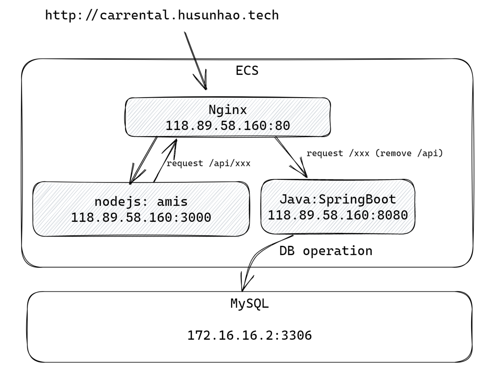

# sunhao-car-rental
A simple car rental system's backend, developed by SpringBoot framework.

You can see project demo here: http://118.89.58.160

## System Design

### User Story

1. Our company provide car-rental service for our customers, we have cars as below:

   | Car Model    | In Stock |
   | ------------ | -------- |
   | Toyota Camry | 2        |
   | BMW 650      | 2        |

2. We **only have 1 store for user to pick up the car**. Temporarily, **user has no alternative choices for pick-up location**.

3. Users can choose the time period for booking cars.

   **Notice:** If there is **no avaliable car** for rent in a time period,  **user have to select anothor time period**. 

4. Due to our limited vehicle resources, in order to allow more users to experience our services, **a user can only rent one car at a time;**

5. The flow chart for a user to book a car is as below.

   

### UI Design

This page is based on the assumption that user has logged in the car rental system. Due to time limitation, I don't design **User Management Module** currently, just focus on core processes of renting a car.  

This page is implemented by **[amis]([介绍 (baidu.com)](https://aisuda.bce.baidu.com/amis/zh-CN/docs/index))** framework. **amis** is a low-code front-end web framework published by Baidu. 

**UI source code is in carrental-ui diretory.**


### API Design

| Seq  | operationId      | url     | method | params                                                       | headers               | body                                                         | description                                           |
| ---- | ---------------- | ------- | ------ | ------------------------------------------------------------ | --------------------- | ------------------------------------------------------------ | ----------------------------------------------------- |
| 1    | getAvailableCars | /cars   | GET    | start_time (String), end_time (String)                       | user_token (**TODO**) | -                                                            | Query available cars (available num > 0）as options.  |
| 2    | placeOrder       | /orders | POST   | -                                                            | user_token (**TODO**) | {<br>"car_model":"${car_model}",<br>"start_time":"${start_time}",<br>"end_time":"${end_time}"<br>} | User submit order to book a car.                      |
| 3    | queryOrders      | /orders | GET    | page_no (Integer), page_size(Integer), keyword(String)(**TODO**) | user_token (**TODO**) | -                                                            | Query order history and return historical order list. |

#### Sequence Diagram for API

1. **getAvailableCars**


2. **placeOrder**

   
   
   
   
3. **queryOrders**

   
   
   ### DB Design
   
   As mentioned above, since the system doen't integrate **User Management Module** currently. We try to make the event keep simple. Thus, in this version's design, we only have **cars** and **orders** table. We can use car table to query cars information, and distribute cars to different orders. I **only add required fields in table**, extra info like create_time, creator, edit_time etc. won't show in this project temporarily. Thus, the ER-diagram like below:
   


```sql
CREATE TABLE `cars` (
  `id` int(11) NOT NULL AUTO_INCREMENT,
  `model` varchar(32) DEFAULT NULL,
  PRIMARY KEY (`id`),
  KEY `idx_model` (`model`)
) ENGINE=InnoDB AUTO_INCREMENT=5 DEFAULT CHARSET=utf8

CREATE TABLE `orders` (
  `id` int(11) NOT NULL AUTO_INCREMENT,
  `car_id` int(11) DEFAULT NULL,
  `model` varchar(32) DEFAULT NULL,
  `start_time` date DEFAULT NULL,
  `end_time` date DEFAULT NULL,
  PRIMARY KEY (`id`),
  KEY `idx_model` (`model`),
  KEY `idx_start_end` (`start_time`,`end_time`)
) ENGINE=InnoDB AUTO_INCREMENT=30 DEFAULT CHARSET=utf8
```


### Deploy Mode

I user Tencent Cloud to publish this project (**Poor, no Master/VISA Card T T**), the deploy framework is as below.



### What's More

Here is the configuration of Nginx, I use it to solve the **CORS** problem on the web server.

```ngin
events {
    worker_connections 1024;
}

http {
    log_format  main  '$remote_addr - $remote_user [$time_local] "$request" '
                      '$status $body_bytes_sent "$http_referer" '
                      '"$http_user_agent" "$http_x_forwarded_for"';

    access_log  /var/log/nginx/access.log  main;

    sendfile            on;
    tcp_nopush          on;
    tcp_nodelay         on;
    keepalive_timeout   65;
    types_hash_max_size 2048;

    include             /etc/nginx/mime.types;
    default_type        application/octet-stream;

    # Load modular configuration files from the /etc/nginx/conf.d directory.
    # See http://nginx.org/en/docs/ngx_core_module.html#include
    # for more information.
    include /etc/nginx/conf.d/*.conf;

    server {
        listen       80 default_server;
        listen       [::]:80 default_server;
        server_name  localhost;
        root         /usr/share/nginx/html;

        # Load configuration files for the default server block.
        include /etc/nginx/default.d/*.conf;

        location / {
		proxy_pass http://localhost:3000;
        }

	location /api/ {
		proxy_pass http://localhost:8080/;
	}

        error_page 404 /404.html;
            location = /40x.html {
        }

        error_page 500 502 503 504 /50x.html;
            location = /50x.html {
        }
    }
}
```

